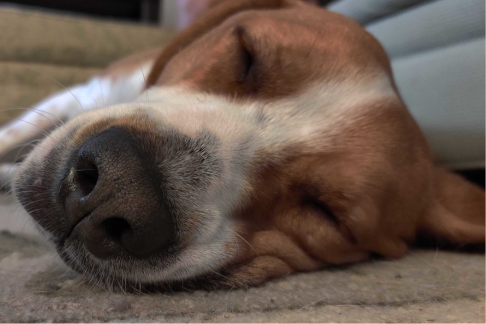

Hi!
I'm a technologist, architect, developer, and leader with a "v-shaped" passion for high-level strategy,
economies of scale, distributed systems, and the most sensible defaults for technology-driven value streams.
I'm an open-source advocate and love leaving my fingerprints across various technical and functional domains.
I've delivered software, infrastructure, and architecture across multiple platforms, styles, and industries.

I believe in peer leadership, motivating through empathy, cultivating through influence,
and coaching with positive guidance.

I avoid absolutes as much as possible.
Trade-offs are everywhere,
and we spend far too much time in the pursuit of 'best practices' when good ones often get us value and feedback in a shorter amount of time.

I'm also a dad, runner, husband, dog enthusiast, and devotee of the fight sciences. These things are very important to
me, but I don't talk about them here!

This is Gravy. He's a dog.
