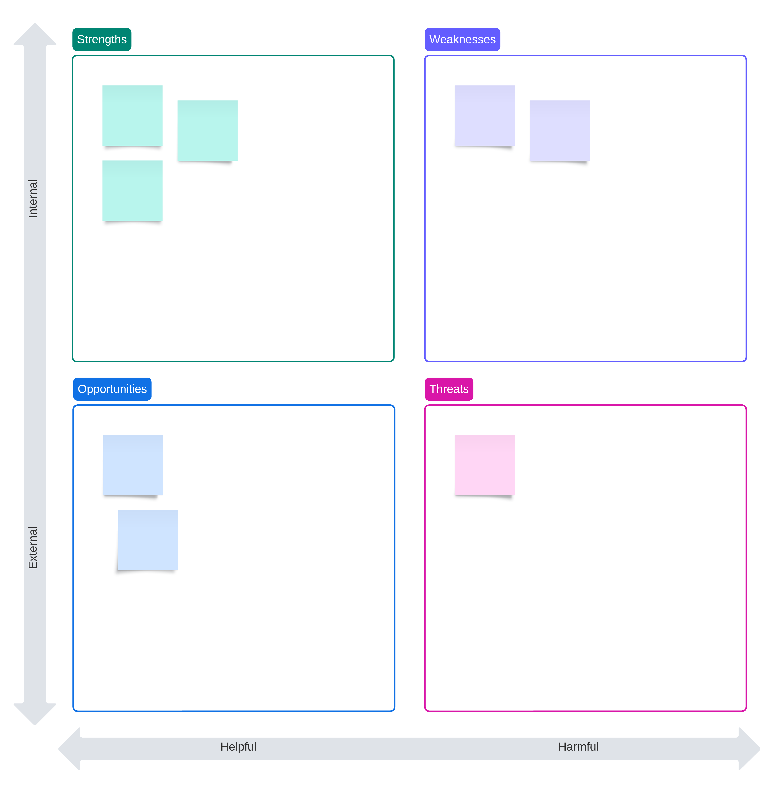
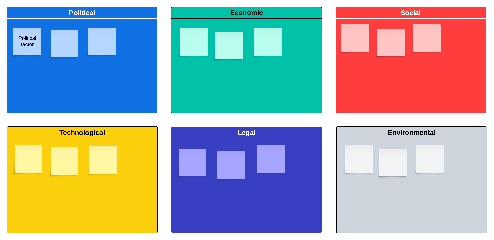
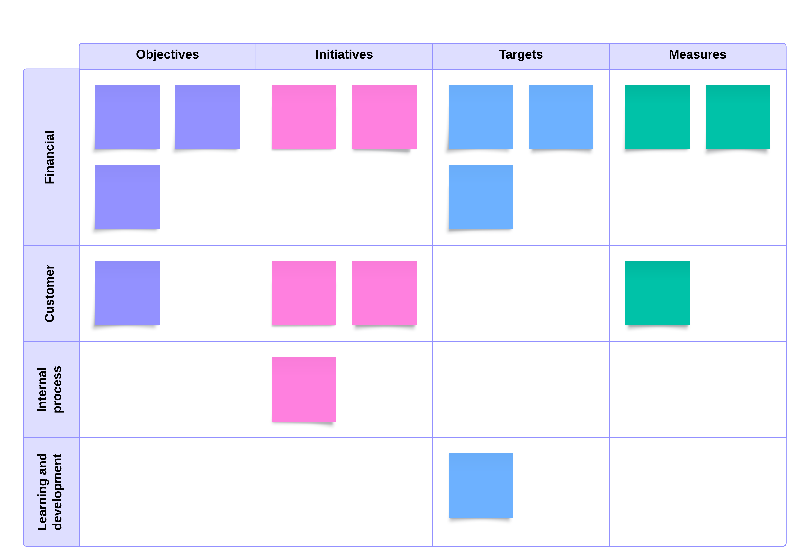

_NOTE: In an effort to provide demonstrations of integrations between SWOT, Balanced Scorecard and PESTLE I performed an ad hoc analysis of a "Generic CAD company". This is the result of analysis I've performed on the top 5 CAD products. (6sense, 2024). In the effort of time, I used unweighted common attributes of these five to populate the diagrams._

### Introduction

SWOT analysis is a strategic planning tool businesses use to identify and evaluate their internal strengths and weaknesses, as well as external opportunities and threats. The acronym SWOT stands for Strengths, Weaknesses, Opportunities, and Threats. By systematically analyzing these four elements, organizations can develop strategies that leverage their strengths, mitigate their weaknesses, capitalize on opportunities, and defend against threats (Gürel, 2017).

_SWOT Matrix w/ Stickies (From LucidChart)_

### Defining SWOT Analysis

SWOT analysis involves a comprehensive review of an organization's internal and external environments. Strengths refer to the internal attributes and resources listing these factors in a matrix, which visually represents the strategic landscape and aids in strategic decision-making.

### Criticisms of SWOT Analysis
Despite its widespread use, SWOT analysis has been criticized on several fronts. One major criticism is its subjective nature. Identifying and categorizing strengths, weaknesses, opportunities, and threats often rely on the judgment and perspective of those conducting the analysis, which can lead to biases and inconsistencies (Pickton & Wright, 1998). Furthermore, SWOT analysis is often critiqued for its simplicity. Critics argue that it provides a static snapshot of the organization's current situation without considering the dynamic and complex nature of the business environment (Valentin, 2001).

Another criticism is that SWOT analysis can lead to a lack of prioritization. Organizations may struggle to focus on the most critical issues because they merely list factors without guiding their relative importance or urgency (Chermack & Kasshanna, 2007). Additionally, SWOT analysis does not offer solutions or strategies; it identifies factors but does not provide actionable steps to address them, which can limit its practical utility (Hill & Westbrook, 1997).

### Addressing the Criticisms
To address the criticisms of subjectivity, organizations should ensure that a diverse group of stakeholders conducts the SWOT analysis. This diversity can provide a more balanced perspective and reduce individual biases. Facilitating workshops where various departments and levels of staff can contribute can lead to a more comprehensive and objective analysis (Phadermrod et al., 2019).

To counter the simplicity and static nature of SWOT analysis, it can be integrated with other strategic planning tools that consider the dynamic environment. For example, combining SWOT with PESTLE analysis (Political, Economic, Social, Technological, Legal and Environmental) can provide a broader context by examining external macroenvironmental factors. This integration helps organizations identify static factors and understand how these factors might evolve (Panagiotou, 2003).

---

_Example of PESTLE analysis w/ stickies from LucidChart_
### Example Integrated SWOT and PESTLE

#### **Part 1: SWOT Analysis**

| Strengths                           | Weaknesses                           |
|-------------------------------------|--------------------------------------|
| S1: Strong brand reputation         | W1: Limited market penetration in emerging markets |
| S2: High customer loyalty           | W2: High software maintenance costs  |
| S3: Robust feature set and integration | W3: Dependence on legacy technologies |

| Opportunities                        | Threats                            |
|--------------------------------------|------------------------------------|
| O1: Growing demand for cloud-based CAD solutions | T1: Intense competition from other CAD software providers |
| O2: Expansion into new industry verticals | T2: Economic downturn affecting customer budgets |
| O3: Advances in AI and machine learning | T3: Rapid technological changes requiring constant updates |

#### **Part 2: PESTLE Analysis**

| Political                           | Economic                            |
|-------------------------------------|-------------------------------------|
| - **P1:** Government policies favoring digital transformation | - **E1:** Economic growth in emerging markets |
| - **P2:** Trade regulations impacting software distribution | - **E2:** Budget constraints due to economic downturn |
| - **P3:** Intellectual property laws | - **E3:** Fluctuating currency exchange rates |

| Social                              | Technological                       |
|-------------------------------------|-------------------------------------|
| - **S1:** Increasing demand for remote and flexible work tools | - **T1:** Rapid advancements in AI and machine learning |
| - **S2:** Growing awareness of digital design benefits | - **T2:** Increased adoption of cloud computing |
| - **S3:** Education and training programs in CAD software | - **T3:** Cybersecurity threats and data privacy concerns |

| Legal                               | Environmental                       |
|-------------------------------------|-------------------------------------|
| - **L1:** Compliance with international software standards | - **En1:** Environmental regulations affecting data centers |
| - **L2:** Data protection regulations (e.g., GDPR) | - **En2:** Sustainable software development practices |
| - **L3:** Licensing and patent issues | - **En3:** Impact of cloud computing on carbon footprint |

---

Addressing the need for prioritization can be achieved by incorporating a ranking or scoring system within the SWOT framework. This involves assessing each factor based on impact, likelihood, and urgency criteria. Such a system can help organizations prioritize issues and focus their resources on critical areas. Tools like the SWOT Matrix can assist in this prioritization by plotting factors on a grid based on their importance and feasibility (Humphrey, 2005).

Moreover, it is beneficial to develop actionable strategies based on the identified factors to enhance the strategic applicability of SWOT analysis. This can be done using the TOWS matrix (Threats, Opportunities, Weaknesses, and Strengths), which helps organizations create strategic options by matching strengths with opportunities, weaknesses with threats, and so on. This approach ensures that the analysis leads to concrete strategic actions rather than just a list of factors (Weihrich, 1982).

### Integrating SWOT with Other Tools
Integrating SWOT analysis with other strategic tools can also enhance its effectiveness. For instance, the Balanced Scorecard can be used with SWOT to align the identified factors with the organization's strategic objectives and performance metrics. This integration ensures that the insights from the SWOT analysis are translated into measurable goals and actions (Kaplan & Norton, 1992). [FourWeekMBA](https://fourweekmba.com/swot-analysis-vs-balanced-scorecard/) compares the two tools excellently.

---

_Example of Balanced Scorecard w/ Stickies from LucidChart_

#### Example Integrated SWOT and Balanced Scorecard

#### **Part 1: SWOT Analysis**

| Strengths                           | Weaknesses                           |
|-------------------------------------|--------------------------------------|
| S1: Strong brand reputation         | W1: Limited market penetration in emerging markets |
| S2: High customer loyalty           | W2: High software maintenance costs  |
| S3: Robust feature set and integration | W3: Dependence on legacy technologies |

| Opportunities                        | Threats                            |
|--------------------------------------|------------------------------------|
| O1: Growing demand for cloud-based CAD solutions | T1: Intense competition from other CAD software providers |
| O2: Expansion into new industry verticals | T2: Economic downturn affecting customer budgets |
| O3: Advances in AI and machine learning | T3: Rapid technological changes requiring constant updates |

#### **Part 2: Balanced Scorecard**

| Financial Perspective                  | Customer Perspective                  |
|----------------------------------------|----------------------------------------|
| **Objective 1:** Increase profitability by leveraging brand reputation | **Objective 1:** Enhance customer satisfaction by leveraging high customer loyalty |
| - **Measure:** Profit margin           | - **Measure:** Customer satisfaction score |
| - **Target:** 20% increase in profit margin | - **Target:** Achieve a 90% customer satisfaction score |
| - **Initiative:** Optimize pricing strategies and reduce costs through process improvements | - **Initiative:** Implement advanced customer support and training programs |
| **Objective 2:** Capture new market segments by expanding into emerging markets | **Objective 2:** Increase market share by diversifying product offerings |
| - **Measure:** Revenue from new markets | - **Measure:** Market share percentage |
| - **Target:** $15M in revenue from new markets within two years | - **Target:** Achieve a 25% market share |
| - **Initiative:** Launch targeted marketing and sales campaigns in emerging markets | - **Initiative:** Introduce new features and products tailored to different industry needs |

| Internal Business Processes Perspective | Learning and Growth Perspective       |
|-----------------------------------------|----------------------------------------|
| **Objective 1:** Improve operational efficiency by leveraging robust feature set and integration | **Objective 1:** Develop employee skills to maintain strong brand reputation |
| - **Measure:** Operational cost per unit | - **Measure:** Employee skill level index |
| - **Target:** Reduce operational costs by 15% | - **Target:** Increase skill level index by 20% |
| - **Initiative:** Implement lean management practices and streamline workflows | - **Initiative:** Provide continuous learning and development programs |
| **Objective 2:** Enhance innovation processes by adopting advances in AI and machine learning | **Objective 2:** Build a flexible workforce to address dependence on legacy technologies |
| - **Measure:** Time to market for new features | - **Measure:** Workforce flexibility index |
| - **Target:** Reduce time to market by 20% | - **Target:** Increase flexibility index by 25% |
| - **Initiative:** Invest in R&D and adopt agile development methodologies | - **Initiative:** Cross-train employees and diversify technology skill sets |

---

Another approach is to use scenario planning alongside SWOT analysis. Scenario planning involves creating detailed and plausible views of different future environments in which the organization might operate. By considering various scenarios, organizations can test the robustness of their strategies against different possible futures, ensuring that they are well-prepared for a range of outcomes. This method addresses the criticism of SWOT being overly static and helps organizations remain agile in a rapidly changing environment (Schoemaker, 1995).

### Practical Application of SWOT Analysis
For a practical application, consider a technology company conducting a SWOT analysis. The company identifies its strengths as a highly skilled workforce and strong R&D capabilities, weaknesses as a limited market presence and high production costs, opportunities in emerging markets and new technological advancements, and threats from intense competition and regulatory changes.

By integrating a prioritization system, the company can rank these factors based on their impact and urgency. For instance, the high production costs might be identified as a critical weakness requiring immediate attention, while opportunities in emerging markets might be seen as a long-term strategic focus.

Using the TOWS matrix, the company can then develop strategies such as leveraging its R&D capabilities (strength) to innovate cost-effective production methods (weakness) and exploring partnerships in emerging markets (opportunity) to expand its market presence (weakness). By systematically addressing these factors, the company can create a comprehensive and actionable strategic plan.

### Conclusion
SWOT analysis is a valuable tool for strategic planning, offering a structured way to evaluate an organization's internal and external environments. However, it has criticisms, including subjectivity, simplicity, lack of prioritization, and limited actionability. By incorporating diverse perspectives, integrating with other strategic tools, using ranking systems, and developing actionable strategies, organizations can address these criticisms and enhance the effectiveness of SWOT analysis. This holistic approach ensures that SWOT remains a dynamic and practical tool in the ever-evolving business landscape.

### References
- Chermack, T. J., & Kasshanna, B. K. (2007). The use of and misuse of SWOT analysis and implications for HRD professionals. *Human Resource Development International, 10*(4), 383-399.
- Gürel, E. (2017). SWOT analysis: A theoretical review. *Journal of International Social Research, 10*(51).
- Helms, M. M., & Nixon, J. (2010). Exploring SWOT analysis – where are we now? A review of academic research from the last decade. *Journal of Strategy and Management, 3*(3), 215-251.
- Hill, T., & Westbrook, R. (1997). SWOT analysis: It's time for a product recall. *Long Range Planning, 30*(1), 46-52.
- Humphrey, A. (2005). SWOT Analysis for Management Consulting. *SRI Alumni Newsletter*.
- Kaplan, R. S., & Norton, D. P. (1992). The Balanced Scorecard—measures that drive performance. *Harvard Business Review, 70*(1), 71-79.
- Panagiotou, G. (2003). Bringing SWOT into focus. *Business Strategy Review, 14*(2), 8-10.
- Phadermrod, B., Crowder, R. M., & Wills, G. B. (2019). Importance-performance analysis based SWOT analysis. *International Journal of Information Management, 44*, 194-203.
- Pickton, D. W., & Wright, S. (1998). What's SWOT in strategic analysis?. *Strategic Change, 7*(2), 101-109.
- Schoemaker, P. J. H. (1995). Scenario planning: A tool for strategic thinking. *MIT Sloan Management Review, 36*(2), 25-40.
- Valentin, E. K. (2001). SWOT analysis from a resource-based view. *Journal of Marketing Theory and Practice, 9*(2), 54-69.
- Weihrich, H. (1982). The TOWS matrix—A tool for situational analysis. *Long Range Planning, 15*(2), 54-66.
- Best CAD Software Software in 2024 | 6sense. (2024). 6sense. https://6sense.com/tech/cad-software

‌